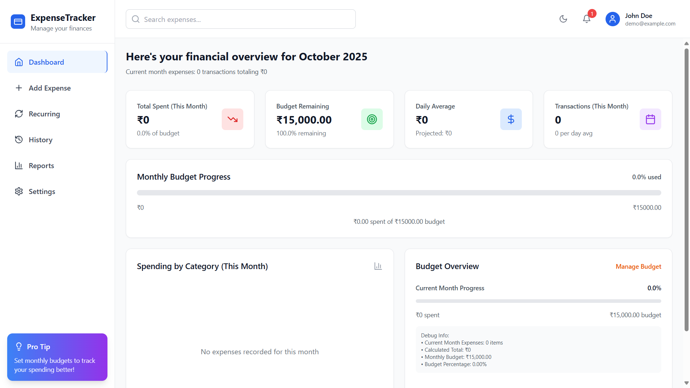
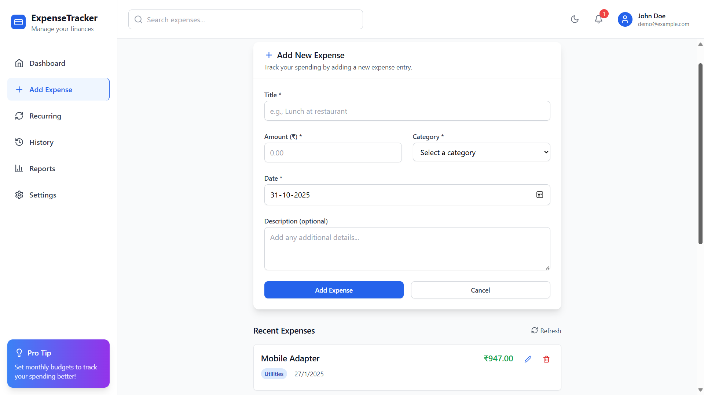
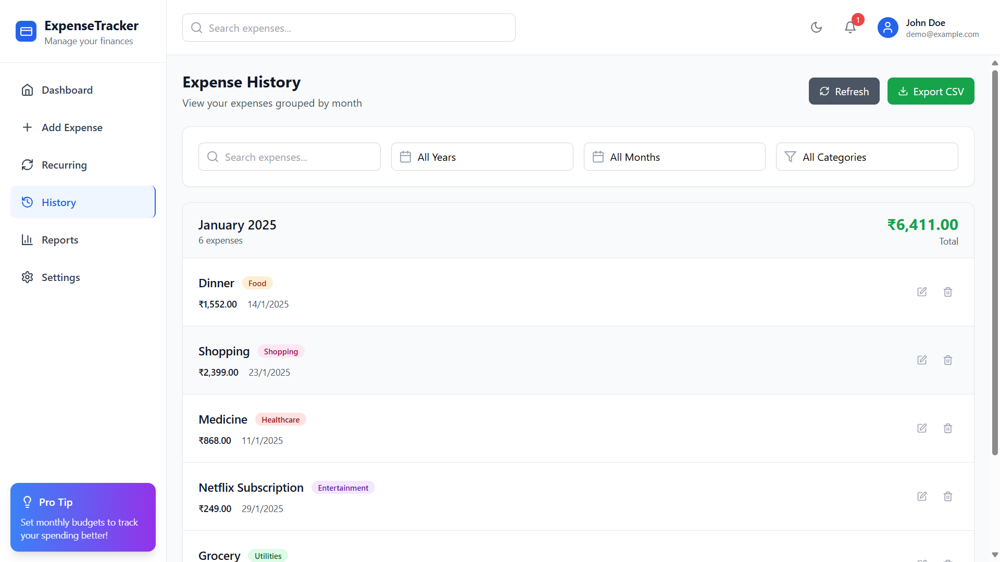
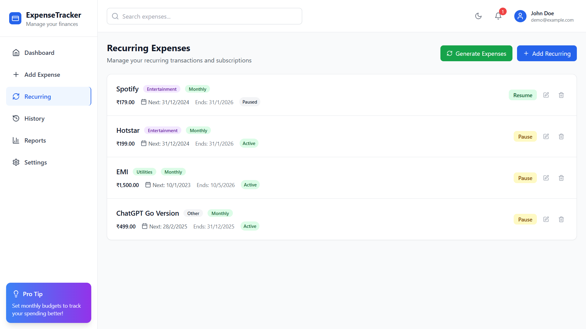
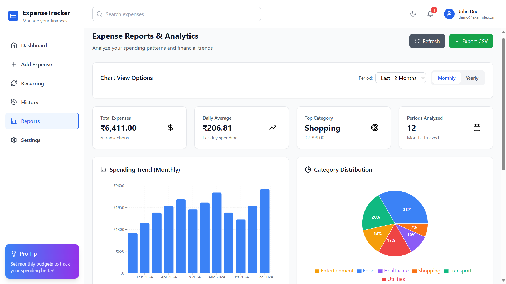
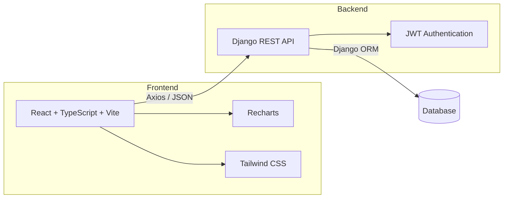

<div align="center">

# Expense Tracker

### Smart Personal Finance Dashboard for Managing & Visualizing Expenses

<a href="#license">
  
</a>
<a href="https://www.python.org/" target="_blank">
  
</a>
<a href="https://www.djangoproject.com/" target="_blank">
  
</a>
<a href="https://react.dev/" target="_blank">
  
</a>

<br/><br/>

**A full-stack personal finance application for tracking expenses, managing recurring payments, and visualizing spending patterns.**

</div>

---

## Table of Contents

- [Overview](#overview)
- [Key Features](#key-features)
- [Demo / Screenshots](#demo--screenshots)
- [Tech Stack](#tech-stack)
- [Architecture](#architecture)
- [Installation](#installation)
- [Usage](#usage)
- [Configuration](#configuration)
- [Roadmap](#roadmap)
- [License](#license)

---

## Overview

**Expense Tracker** is a full-stack personal finance management application built using **React, TypeScript, Django, and Django REST Framework**.

It provides users with a simple and interactive way to record, organize, and analyze their expenses.

The application helps users:

- Record and manage daily expenses
- Categorize transactions for better organization
- Track recurring expenses and subscriptions
- Analyze spending patterns using charts and reports
- Search and filter transaction history
- Import and export expense data using CSV
- Manage personal finance data through a responsive dashboard

---

## Key Features

- **JWT Authentication** — Secure user authentication with protected API endpoints.
- **Expense Management** — Add, edit, delete, and search expenses.
- **Categories & Tags** — Organize transactions using categories and keywords.
- **Recurring Payments** — Manage daily, weekly, monthly, and yearly recurring expenses.
- **Dashboard Analytics** — View spending summaries and financial insights.
- **Interactive Charts** — Visualize monthly and category-wise spending.
- **Transaction History** — Search and filter previous expenses.
- **Reports** — Analyze expenses based on categories and time periods.
- **CSV Import/Export** — Import and export expense data using PapaParse.
- **Responsive Design** — Mobile-friendly interface built with Tailwind CSS.
- **API Integration** — React frontend communicates with Django through REST APIs.
- **Local Storage Fallback** — Selected frontend functionality can use local storage when the backend is unavailable.

---

## Demo / Screenshots

### Dashboard

<p align="center">
  
  <br/>
  <em>Dashboard providing an overview of spending and expense activity.</em>
</p>

### Add Expense

<p align="center">
  
  <br/>
  <em>Add expenses with categories, amount, date, and additional information.</em>
</p>

### Transaction History

<p align="center">
  
  <br/>
  <em>Searchable and filterable history of recorded transactions.</em>
</p>

### Recurring Expenses

<p align="center">
  
  <br/>
  <em>Manage subscriptions and recurring payments.</em>
</p>

### Reports & Analytics

<p align="center">
  
  <br/>
  <em>Analyze expenses using category-based and time-based reports.</em>
</p>

---

## Tech Stack

### Frontend

- React 18
- TypeScript
- Vite
- React Router
- Tailwind CSS
- Recharts
- Axios
- React Hot Toast
- date-fns
- PapaParse

### Backend

- Python
- Django 4.2
- Django REST Framework
- Simple JWT
- django-cors-headers
- Pillow

### Database

- SQLite for development
- Can be configured with PostgreSQL or MySQL

### Authentication

- JWT authentication using Django REST Framework SimpleJWT

---

## Architecture



### Application Flow

```text
User
  │
  ▼
React + TypeScript Frontend
  │
  │ HTTP / JSON
  │ Axios
  ▼
Django REST Framework API
  │
  ├──── JWT Authentication
  │
  ▼
Django ORM
  │
  ▼
Database
```

The **frontend** handles the user interface, routing, API communication, and data visualization.

The **backend** exposes RESTful API endpoints and manages authentication, application logic, and database operations.

The **database** stores users, expenses, categories, and recurring expense information.

---

## Installation

### Prerequisites

Make sure the following are installed:

- Node.js 18+ (20+ recommended)
- npm
- Python 3.10+
- Git

### 1. Clone the Repository

```bash
git clone https://github.com/theakp03/Expense_Tracker.git
cd Expense_Tracker
```

### 2. Create a Python Virtual Environment

#### Windows PowerShell

```powershell
python -m venv .venv
.\.venv\Scripts\Activate.ps1
```

#### Windows Command Prompt

```cmd
python -m venv .venv
.venv\Scripts\activate
```

#### Linux / macOS

```bash
python3 -m venv .venv
source .venv/bin/activate
```

### 3. Install Backend Dependencies

From the project root:

```bash
pip install -r backend/requirements.txt
```

Move to the backend directory:

```bash
cd backend
```

Run database migrations:

```bash
python manage.py migrate
```

Create an admin account if required:

```bash
python manage.py createsuperuser
```

Start the Django server:

```bash
python manage.py runserver
```

By default, Django runs at:

```text
http://localhost:8000
```

### 4. Install Frontend Dependencies

Open another terminal in the project root:

```bash
npm install
```

Start the Vite development server:

```bash
npm run dev
```

The frontend normally runs at:

```text
http://localhost:5173
```

---

## Usage

### Start Backend

From the project root:

```bash
cd backend
python manage.py runserver
```

### Start Frontend

Open another terminal in the project root:

```bash
npm run dev
```

Open the application in your browser:

```text
http://localhost:5173
```

Users can register or log in through the application. Protected API requests require a valid JWT access token.

### Production Build

To generate an optimized frontend production build:

```bash
npm run build
```

The generated files will be available inside the `dist` directory.

---

## Configuration

### API Base URL

During local development, the frontend communicates with the Django backend.

Default API base URL:

```text
http://localhost:8000/api
```

If the backend runs on another host or port, update the frontend API configuration accordingly.

### CORS

The Django backend uses `django-cors-headers`.

Make sure the frontend origin is allowed during development:

```text
http://localhost:5173
```

### Database

SQLite is used for local development.

The Django database configuration can be changed to use databases such as:

- PostgreSQL
- MySQL

The appropriate database driver and Django configuration must be added before switching databases.

---

## Authentication Flow

The application uses **JWT-based authentication**.

```text
Register / Login
       │
       ▼
Django REST API
       │
       ▼
Access + Refresh Token
       │
       ▼
React Frontend
       │
       ▼
Authenticated API Requests
```

The frontend uses the JWT access token when making requests to protected API endpoints.

---

## Roadmap

- [ ] Budget limits and spending alerts
- [ ] Multi-currency support
- [ ] Currency conversion
- [ ] Advanced expense filtering
- [ ] Saved filter views
- [ ] XLSX export
- [ ] Google Sheets integration
- [ ] Progressive Web App (PWA) support
- [ ] Offline mode
- [ ] Dark mode and custom themes
- [ ] Production database configuration
- [ ] Cloud deployment

---

## License

This project is distributed under the **Apache License 2.0**.

See the [`LICENSE`](LICENSE) file for complete license information.

---

## Repository

**GitHub:** https://github.com/theakp03/Expense_Tracker

If you find this project useful, consider giving the repository a star.